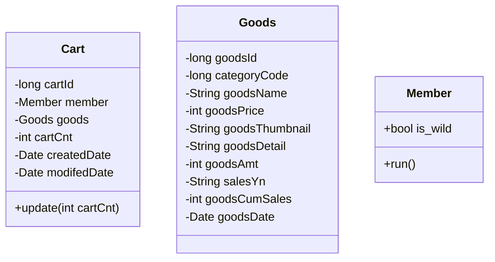

title: Cart 리팩토링
categories: project
tags: [spring, dogiver]

### 목표

* 장바구니 상품 담기, 수량 변경하기



* 하나의 Cart는 하나의 Member를 가질 수 있다.
* 하나의 Cart는 하나의 Goods를 가질 수 있다.

* 하나의 Member는 여러 Cart를 가질 수 있다.

* 하나의 Goods는 여러 Cart를 가질 수 있다.


```mysql
SELECT /*+INDEX_DESC(cart pk_cart)*/
       C.cartId as cartId 
     , C.cartCnt as cartCnt
     , G.goodsName as goodsName
     , G.goodsPrice as goodsPrice
     , G.goodsThmbnail as goodsThumbnail
  FROM Cart as C
       INNER JOIN goods G ON C.goodsId = G.goodsId
 WHERE C.email = email
 
```


**Cart 도메인**

```java
package com.spare.dogiver.domain;

import java.util.Date;

import lombok.Builder;
import lombok.Getter;
import lombok.NoArgsConstructor;

@Getter
@NoArgsConstructor
public class Cart {
	private long cartId;
	
	private Member member;
	private Goods goods;
	
	private long cartCnt;
	
	private Date createdDate;
	private Date modifedDate;
	
	@Builder
	public Cart(Member member, Goods goods, long cartCnt) {
		this.member = member;
		this.goods = goods;
		this.cartCnt = cartCnt;
	}
	
	public void update(long cartCnt) {
		this.cartCnt = cartCnt;
	}
}

```


Mybatis resultMap